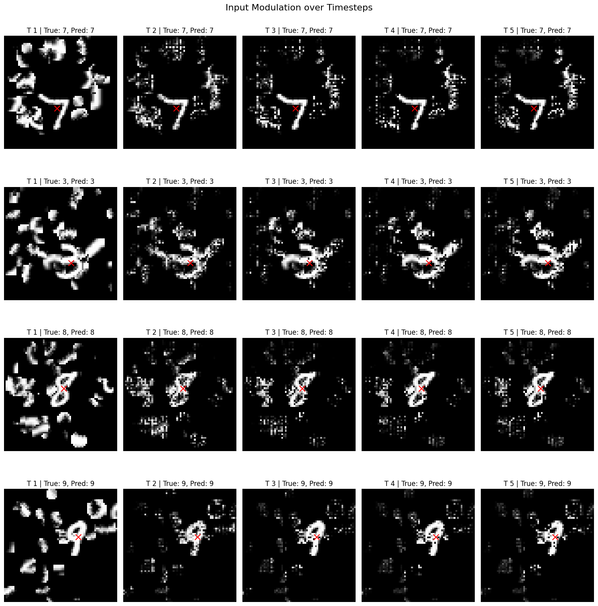
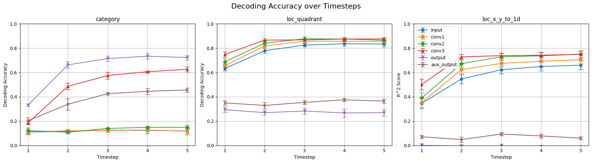
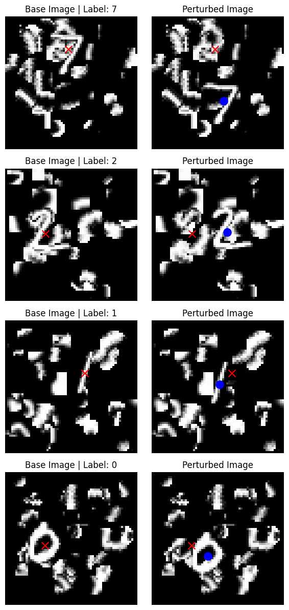
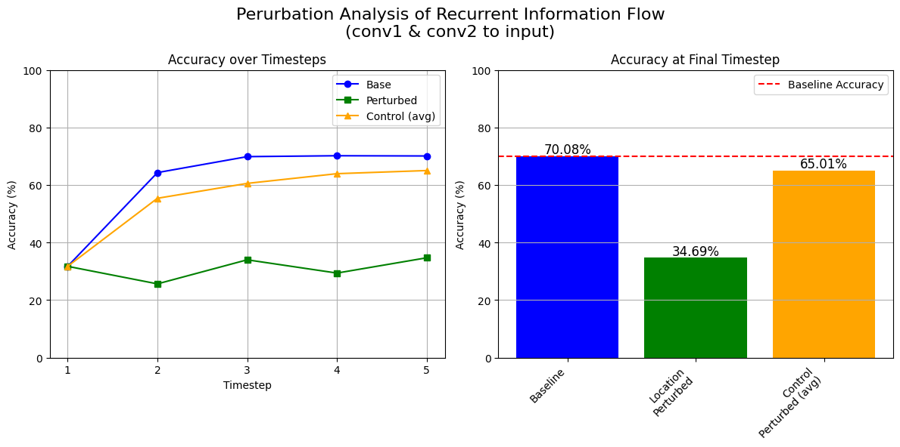
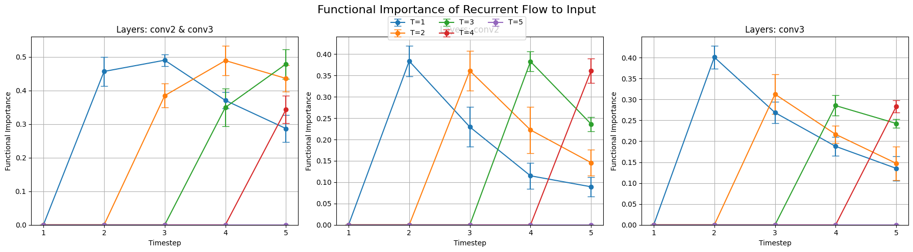

# rcnn-aux-variables

ref:
- Thorat, S., Aldegheri, G., & Kietzmann, T. C. (2021, November 15). Category-orthogonal object features guide information processing in recurrent neural networks trained for object categorization. arXiv.org. https://arxiv.org/abs/2111.07898

replication results with slight modifications / variations to the original implementation and analysis:

### Input modulation through recurrent flow from later convolutional layers to input.
   
### Auxiliary variable decoding across layers and timesteps:

### perturbation analysis of auxiliary variable information in the recurrent information flow:
#### example of location perturbations applied to input images:
 
#### accuracy after location-perturbation vs control(randome) perturbation of matched magnitude (displacment of equal norms):  

#### functional importance of auxiliary variable information in the recurrent information flow:

